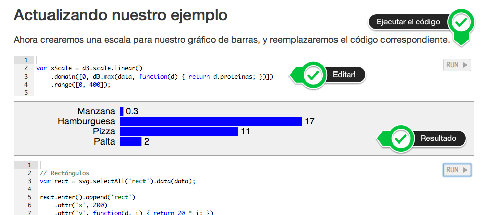

# Introducción a D3

Material para el curso _Visualización de datos con D3.js_, dictado en Julio de 2014 por [Masega](www.masega.co) en conjunto con [Poderomedia Academy](www.poderomedia.org).

[Descargar los ejemplos](https://github.com/masegalab/curso-d3-basico/blob/master/dist/curso-d3.zip?raw=true)

## Uso

El material para el curso está compilado y listo para usar. Para usar la versión compilada, bajar y descomprimir el archivo curso-d3.zip y abrir el archivo `index.html`. Para los ejemplos que necesitan datos externos (archivos JSON o CSV), se require usar un servidor web estático para servir los archivos. Usando Python, se puede crear un servidor fácilmente usando la línea de comandos (desde el directorio con el código):

    $ python -m SimpleHTTPServer

y luego abrir la siguiente URL en el browser: [http://localhost:8000](http://localhost:8000).

Las secciones del curso contienen bloques de código y el resultado de ejecutar el código. Los bloques de código son ejecutables y editables, se pueden modificar y ejecutar. Algunos bloques de código dependen de bloques precedentes y tienen que ser editados en orden.

Para entender mejor los ejemplos, se puede examinar la estructura de las páginas usando las [Developer Tools](https://developer.chrome.com/devtools/index) del browser.

## Compilar

Para compilar el contenido del curso, se necesita Node, Grunt, Bower y Jekyll. Asumiendo que estos programas están instalados, los comandos necesarios para instalar las dependencias y compilar el contenido son:

    $ npm install    # Instala los paquetes de Node necesarios
    $ bower install  # Instala las dependencias front-end
    $ grunt less     # Compila los estilos
    $ jekyll build --config _static.yml

Esto generará el directorio `curso-d3`, que tiene el contenido para ser usado de forma estática.

